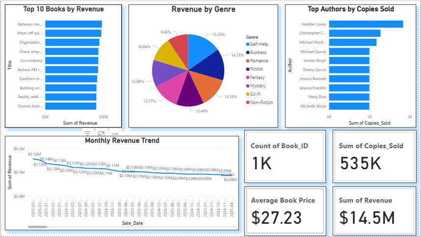

# 📚 Best Selling Books Analytics

## 📌 Overview
This project analyzes **1,000+ book sales records** to identify **top-selling books, authors, and genres**.  
It covers **data generation, cleaning, SQL analysis**, and an **interactive Power BI dashboard** for visualization.

---

## 🚀 Features
- ✅ Generate and clean book sales data using **Python**
- ✅ Store and query data in **MySQL**
- ✅ Perform data analysis using **SQL**
- ✅ Build a **Power BI dashboard** to visualize insights

---

## 📊 Dashboard Insights
The Power BI dashboard includes:
- **Top 10 Books by Revenue**
- **Revenue by Genre**
- **Top Authors by Copies Sold**
- **Monthly Revenue Trend**
- **Average Book Price**

---

## 🛠️ Skills Used
- **Python** (Data Generation & Preprocessing)
- **Pandas** (Data Cleaning)
- **SQL** & **MySQL** (Data Storage & Analysis)
- **Power BI** (Visualization & Dashboarding)
- **Data Analysis** & **Data Visualization**

---

## 📝 How to Run the Project

Step 1 — Install Required Packages
```bash
pip install pandas faker

Step 2 — Generate Dataset
python generate_dataset.py
This will create a dataset named book_sales.csv.

Step 3 — Preprocess the Data
python preprocess_books.py
This will clean the dataset and save it as book_sales_clean.csv.

Step 4 — Load Data into MySQL
Open MySQL Workbench or Command Line
Create a database:
CREATE DATABASE book_sales_db;
Import book_sales_clean.csv into a table.

Step 5 — Open Power BI Dashboard
Open dashboard.pbix in Power BI Desktop

Explore the interactive charts and insights

📊 Power BI Dashboard Preview

<p align="center"> <a href="https://github.com/Suhani6167/Best_Selling_Books_Analytics/blob/main/dashboard_screenshot.png" target="_blank">  </a> </p>